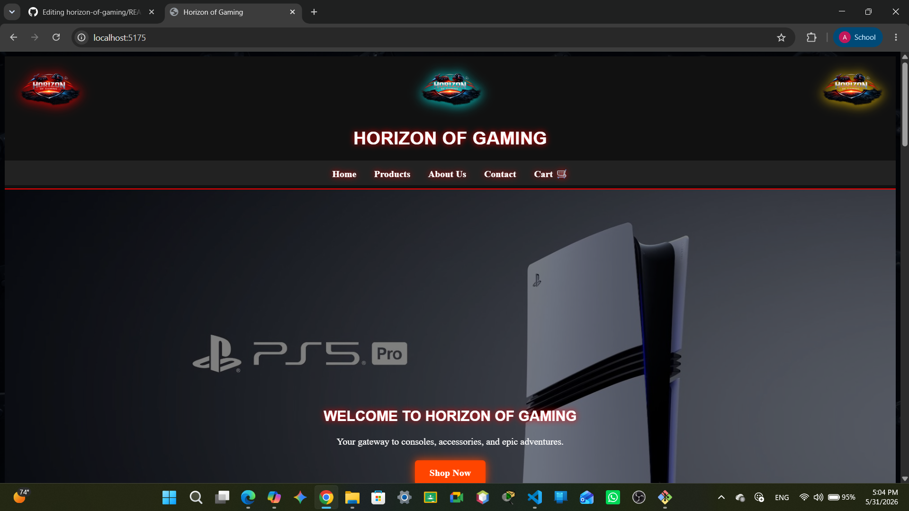
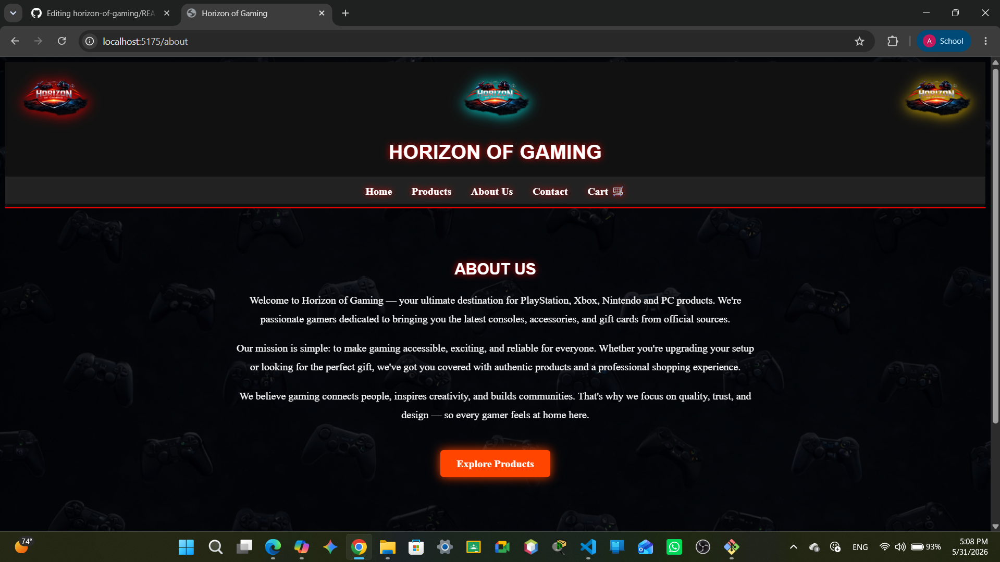
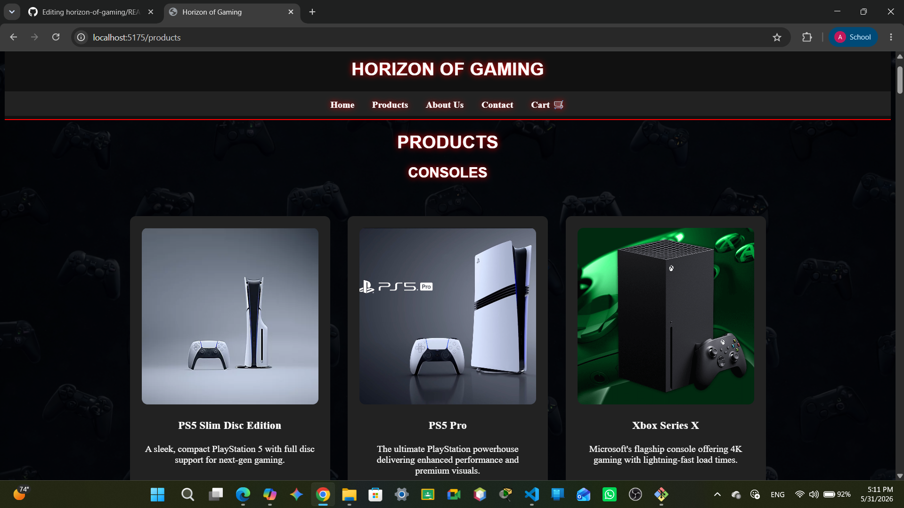
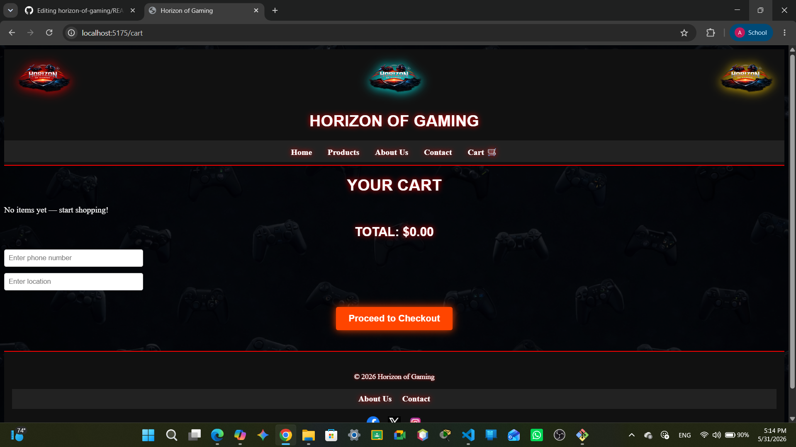
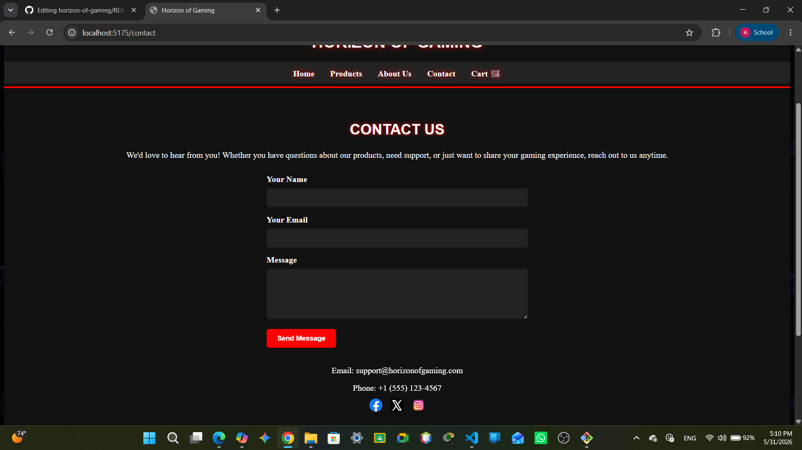

# Horizon of Gaming 🎮

A React-based gaming e-commerce web application for PlayStation, Xbox, Nintendo, and PC products.
## Live Demo

👉 [View Horizon of Gaming on GitHub Pages](https://12431556-coder.github.io/horizon-of-gaming/)
## Screenshots

### Home Page


### About Page


### Products Page


### Cart Page


### Contact Page


---

## Project Description

Horizon of Gaming is a frontend web application built with ReactJS. It serves as an online storefront for gaming consoles, laptops, games, accessories, and gift cards. The site features a dark gaming aesthetic with responsive design that works on all screen sizes.

**Pages:**
- **Home** — Hero section, featured consoles, games showcase, accessories preview
- **Products** — Full catalog: Consoles, Laptops, Games, Accessories, Gift Cards
- **About** — Company mission and description
- **Contact** — Contact form with validation and submission feedback

---

## Technologies Used

- **ReactJS** (v18) — Component-based frontend framework
- **React Router DOM** (v6) — Client-side navigation between pages
- **Vite** — Fast development build tool
- **CSS3** — Custom styling with responsive media queries

---

## Setup Instructions

### Prerequisites
- [Node.js](https://nodejs.org/) (v18 or higher)
- npm (comes with Node.js)

### Steps

1. **Clone or download** this repository
   ```bash
   git clone https://github.com/YOUR_USERNAME/horizon-of-gaming.git
   cd horizon-of-gaming
   ```

2. **Copy your images** into the `public/images/` folder
   (All your existing images go here — ps5pro.jpeg, xbox-series-x.png, etc.)

3. **Install dependencies**
   ```bash
   npm install
   ```

4. **Run the development server**
   ```bash
   npm run dev
   ```
   Open [http://localhost:5173](http://localhost:5173) in your browser.

5. **Build for production**
   ```bash
   npm run build
   ```

---

## Deployment

### Vercel (Recommended — easiest)
1. Push your code to a GitHub repository
2. Go to [vercel.com](https://vercel.com) and import your repo
3. Vercel auto-detects Vite — click **Deploy**

### Netlify
1. Push your code to GitHub
2. Go to [netlify.com](https://netlify.com) → **Add new site** → **Import from Git**
3. Build command: `npm run build` | Publish directory: `dist`

### GitHub Pages
1. Install the GitHub Pages plugin:
   ```bash
   npm install --save-dev gh-pages
   ```
2. In `vite.config.js`, add your repo name as the base:
   ```js
   export default defineConfig({
     base: '/your-repo-name/',
     plugins: [react()],
   })
   ```
3. Add to `package.json` scripts:
   ```json
   "deploy": "gh-pages -d dist"
   ```
4. Run `npm run build && npm run deploy`

---

## Project Structure

```
horizon-of-gaming/
├── public/
│   └── images/          ← Copy all your images here
├── src/
│   ├── components/
│   │   ├── Header.jsx   ← Site-wide navigation header
│   │   ├── Footer.jsx   ← Site-wide footer
│   │   └── ScrollToTop.jsx
│   ├── pages/
│   │   ├── Home.jsx
│   │   ├── Products.jsx ← All product data + cards
│   │   ├── About.jsx
│   │   └── Contact.jsx  ← Controlled form with React state
│   ├── App.jsx          ← Router setup
│   ├── main.jsx         ← React entry point
│   └── style.css        ← All styles
├── index.html
├── package.json
└── vite.config.js
```

---

## Group Contribution Statement

| Member | Contribution |
|--------|-------------|
| | |
| | |
| | |

---

*© 2026 Horizon of Gaming — CSCI390 Web Programming Project Phase 2*
